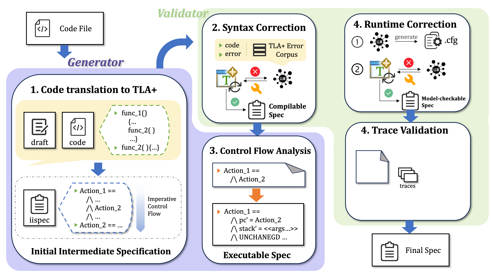
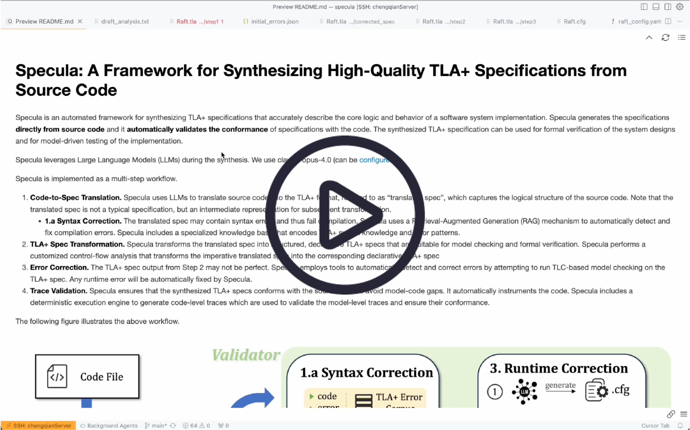

# Specula: A Framework for Synthesizing High-Quality TLA+ Specifications from Source Code

Specula is an automated framework for synthesizing TLA+ specifications that accurately describe the core logic and behavior of a software system implementation. Specula:
- generates specifications **directly from source code**
- **automatically validates the conformance** of specifications with the code
- can be used for **formal verification of system designs** and **model-driven testing**

Specula has synthesized TLA+ specifications for [etcd’s Raft implementation](https://github.com/etcd-io/raft/blob/main/raft.go) (written in Go) and Asterinas’s [SpinLock implementation](https://github.com/asterinas/asterinas/blob/main/ostd/src/sync/spin.rs) (written in Rust). See [below](#case-study-etcd-raft) for our Raft case study. We are actively applying Specula to new systems.

Specula is a multi-step, agentic workflow. See below for an architecture diagram and expand the Architecture Details toggle for a detailled view.



<details>
<summary><b>Architecture Details</b></summary>

1. **Code-to-Spec Translation.** Specula uses LLMs to translate source code into the TLA+ format, referred to as “translated spec”, which captures the logical structure of the source code. Note that the translated spec is not a typical specification, but an intermediate representation for subsequent transformation.
   - **1.a Syntax Correction.** The translated spec may contain syntax errors and thus fail compilation. Specula uses a Retrieval-Augmented Generation (RAG) mechanism to automatically detect and fix compilation errors. Specula includes a specialized knowledge base that encodes TLA+ syntax knowledge and error patterns.
2. **[TLA+ Spec Transformation](docs/CFA.md).** Specula transforms the translated spec into structured, declarative TLA+ specs that are suitable for model checking and formal verification. Specula performs a specialized Control Flow Analysis that transforms the imperative translated spec into the corresponding declarative TLA+ spec.
Details can be found in [the CFA doc](docs/CFA.md).
3. **Error Correction.** The TLA+ spec output from Step 2 may not be perfect. Specula employs tools to automatically detect and correct errors by attempting to run TLC-based model checking on the TLA+ spec. Any runtime error will be automatically fixed by Specula. 
4. **Trace Validation.** Specula ensures that the synthesized TLA+ specs conforms with the source code to avoid model-code gaps. It automatically instruments the code. Specula includes a deterministic execution engine to generate code-level traces which are used to validate the model-level traces and ensure their conformance.
</details>

See [here](#demo-video) for a demo walkthrough. Specula is under active development and output specs may currently require some manual tweaking.

## Quickstart

```bash
git clone https://github.com/specula-org/Specula.git && cd Specula
bash scripts/setup.sh
export ANTHROPIC_API_KEY=YOUR_API_KEY
./specula    # prints usage instructions
```

Please refer to [Usage](https://github.com/specula-org/Specula/blob/main/docs/Usage.md) for detailed usage, which provides step-by-step instructions of the workflow and configuration tips. Alternatively, follow along with our case study below.

## Case Study (etcd Raft)

We present an end-to-end demo of how to use Specula to generate a TLA+ specification for etcd’s Raft implementation. See [here](#demo-video) for a video walkthrough.

### 0. Configure LLM Access
```
export ANTHROPIC_API_KEY=YOUR_API_KEY
```

We currently use Claude-Opus-4.0 and Claude-Sonnet-4.0 as our primary models, but OpenAI, Deepseek, and Gemini models are supported. 

### 1. Code-to-Spec Translation

```bash
./specula step1 examples/etcd/source/raft.go output/etcd/spec/step1/ --mode draft-based
```

<details><summary><b>Inputs and Outputs</b></summary>

*   **Inputs**: Go source code for Raft (`examples/etcd/source/raft.go`).
*   **Outputs**: 
    - An initial TLA+ specification (`output/etcd/spec/step1/Raft.tla`).
    - If syntax correction was needed, a syntactically correct version (`output/etcd/spec/step1/corrected_spec/Raft.tla`).
    - An analysis draft (`output/etcd/spec/step1/draft_analysis.txt`)
*   **Note**: The syntax correction loop is integrated into this phase.
</details>

### 2. TLA+ Specification Transformation

```bash
./specula step2 tools/cfa/input/example/Raft.tla output/etcd/spec/step2/Raft.tla
```

<details><summary><b>Inputs and Outputs</b></summary>

*   **Inputs**: The translated, corrected spec  (`examples/etcd/spec/step1/corrected_spec/Raft.tla`).
*   **Outputs**: A structured TLA+ specification (`output/etcd/spec/step2/Raft.tla`).
*   **Note**: The CFA transformation tool is a work in progress. Its parser is not yet fully robust and may require manual adjustments to the input specification to run successfully. 
</details>

### 3. Runtime Error Correction

```bash
./specula step3 examples/etcd/spec/step2/Raft.tla output/etcd/spec/step3/
```

<details><summary><b>Inputs and Outputs</b></summary>

*   **Inputs**: A TLA+ specification (e.g., `examples/etcd/spec/step2/Raft.tla` from Step 2).
*   **Outputs**:
    - A TLC configuration file (`output/etcd/spec/step3/Raft.cfg`)
    - A runtime-corrected TLA+ specification (`output/etcd/spec/step3/corrected_spec/Raft.tla`)
</details>

### 4. Trace Validation

```bash
./specula step4 \
    --tla examples/etcd/spec/step3/Raft.tla \
    --cfg examples/etcd/spec/step3/Raft.cfg \
    --auto-config output/etcd/spec/step4/raft_config.yaml \
    --stub-template templates/instrumentation/go_trace_stub.template \
    --output examples/etcd/output/instrumented_raft.go \
    output/etcd/spec/step4/spec/
    examples/etcd/config/raft_config.yaml \
    examples/etcd/source/raft.go \
    --verbose
```

<details><summary><b>Inputs and Outputs</b></summary>

-   **Inputs**:
    - The TLA+ specification from Step 3 (`examples/etcd/spec/step3/Raft.tla` and `Raft.cfg`).
    - Original source code from [etcd/raft repository](https://github.com/etcd-io/raft.git)
    - Configuration file (`examples/etcd/config/raft_config.yaml`) mapping TLA+ actions to source functions
    - Language-specific instrumentation template (`templates/instrumentation/go_trace_stub.template`)
-   **Outputs**:
    - An automatically generated trace configuration file (`output/etcd/spec/step4/raft_config.yaml`).
    - Trace validation TLA+ specification (`output/etcd/spec/step4/spec/specTrace.tla`).
    - Trace validation TLC configuration file (`output/etcd/spec/step4/spec/specTrace.cfg`).
    - Instrumented source code (`examples/etcd/output/instrumented_raft.go`)
    - System execution traces (`examples/etcd/runners/raft_simulator/raft_trace.ndjson`)

</details>

<details>
<summary><b>Running Configuration Generation and Instrumentation Separately</b></summary>

Currently, this combined `step4` subcommand only works for Raft systems; Asterinas and other systems will be added shortly.

Under the hood, it just calls the following two subphases:

#### Configuration Generation
```bash
./specula step4.1 \
    --tla examples/etcd/spec/step3/Raft.tla \
    --cfg examples/etcd/spec/step3/Raft.cfg \
    --auto-config output/etcd/spec/step4/raft_config.yaml \
    output/etcd/spec/step4/spec/
```

*   **Inputs**: The TLA+ specification from Step 3 (`examples/etcd/spec/step3/Raft.tla` and `Raft.cfg`).
*   **Outputs**:
    - An automatically generated trace configuration file (`output/etcd/spec/step4/raft_config.yaml`).
    - Trace validation TLA+ specification (`output/etcd/spec/step4/spec/specTrace.tla`).
    - Trace validation TLC configuration file (`output/etcd/spec/step4/spec/specTrace.cfg`).

#### Instrumentation
```bash
# Step 4.2a: Instrument the source code
./specula step4.2 \
    examples/etcd/config/raft_config.yaml \
    examples/etcd/source/raft.go \
    --stub-template templates/instrumentation/go_trace_stub.template \
    --output examples/etcd/output/instrumented_raft.go \
    --verbose

# Step 4.2b: Run instrumented system to generate traces
cd examples/etcd/runners/raft_simulator
go run main.go

# Step 4.2c: Convert system traces to TLA+ format
cd ../..
python3 scripts/trace_converter.py -input ./runners/raft_simulator/trace.ndjson -output ./spec/step4/spec/ -mode simple

# Step 4.2d: Validate traces with TLA+ model checker
cd spec/step4/spec
export TRACE_PATH=trace.ndjson
java -cp "../../../../../lib/tla2tools.jar" tlc2.TLC \
    -config specTrace.cfg specTrace.tla
```

*   **Inputs**:
    - Original source code from [etcd/raft repository](https://github.com/etcd-io/raft.git)
    - Configuration file (`examples/etcd/config/raft_config.yaml`) mapping TLA+ actions to source functions
    - Language-specific instrumentation template (`templates/instrumentation/go_trace_stub.template`)
*   **Outputs**: 
    - Instrumented source code (`examples/etcd/output/instrumented_raft.go`)
    - System execution traces (`examples/etcd/runners/raft_simulator/raft_trace.ndjson`)

</details>

### Final Result 

A final generated TLA+ specification example for etcd's Raft implementation available [here](examples/etcd/spec/step4/spec/Raft.tla). Try it yourself!

> [!WARNING]
> The TLA+ specification may need to be tweaked by hand in certain steps of the workflow during error correction (Step 1.a and 3) and trace validation (Step 4). In practice, the amount of effort is small. For example, we changed approximately 20 lines of specifications during this case study. 

<details>
<summary><b>Cost and Effort Analysis</b></summary>

The table summarizes the cost breakdown of synthesizing TLA+ specs for etcd's Raft implementation.

| Step | LLM Model | Input Tokens | Output Tokens | LLM Cost (USD) | Manual Effort | Total Step Cost |
|------|-----------|--------------|---------------|----------------|---------------|-----------------|
| 1. Code-to-Spec Translation | Claude-Opus-4.0 | 50,000 | 12,000 | $1.65 | 0 min | **$1.65** |
| 1.a Syntax Correction | Claude-Sonnet-4.0 | 12,000 | 10,000 | $0.19* | < 10 min | **$0.19 * 5** |
| 2. TLA+ Transformation | None | - | - | $0.00 | < 10 min | **$0.00** |
| 3. Runtime Error Correction | Claude-Sonnet-4.0 | 10,000 | 10,000 | $0.18* | < 15 min |  **$0.18 * 5** |
| 4. Trace Validation | Claude-Sonnet-4.0 | 10,000 | 700 | $0.04 | ~1 hours | **$0.04** |
| **Total** | | **170,000** | **112,700** |  | **~1.5 hours** | **$3.54** |

**Notes**
- Correction cost is per iteration. Multiple iterations may be required for complex specifications.
- LLM price: Claude-Opus-4.0 (\$15/M input, \$75/M output), Claude-Sonnet-4.0 (\$3/M input, \$15/M output).
- Manual effort includes syntax error fixes, consistency validation, and trace alignment.

</details>

## Demo Video

<a href="https://www.youtube.com/watch?v=b-QBO860zZY" title="Click to watch the demo on YouTube">
  
</a>
