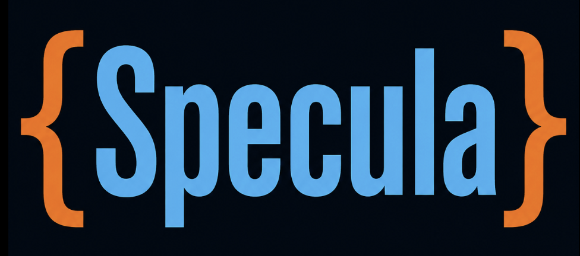

<p align="center">
  <picture>
    <source media="(prefers-color-scheme: dark)" srcset="pics/logo.png">
    
  </picture>
</p>

<h2 align="center">
Scaling formal specs for autonomous bug finding
</h2>

Specula finds deep bugs in concurrent and distributed system code. 
It uses coding agents to write TLA+ specs of the target system, including invariants that capture the system's correctness properties and formal models that describe the system implementation. It then model-checks the specs and reproduces violations at the code level. Specula has been used to find deep bugs in many open-source projects.

We maintain [a list of bugs found by Specula](https://docs.google.com/spreadsheets/d/1AVXdKjNfD4952hZqyB-_wTdrzeTw0SD73f3F0zWJ0as). We would love to hear about the bugs you find using Specula.

## Prerequisites

- Python 3.10+ with pip
- [uv](https://docs.astral.sh/uv/)
- Java 21+ with Maven
- GitHub CLI `gh`
- Supported agents (Claude Code, Codex, or Copilot CLI). Please contribute [adapters](./scripts/launch/adapters) for new agents.
- **LLM with strong reasoning capability at high reasoning effort.** Specula relies on the LLM to read code, infer invariants, and reason about counterexamples.

> **Windows:** run Specula inside [WSL2](https://learn.microsoft.com/windows/wsl/install). Native Windows (outside WSL2) is not supported yet.

## Setup

```bash
git clone https://github.com/specula-org/Specula.git && cd Specula
uv tool install -e .   # installs the `specula` command
specula setup          # installs the agent skills and MCP tools, builds the bundled tools
```

<details>
<summary>Manual Setup</summary>

You need to set up the Specula Agent Skills and MCP with your coding agent.

- Symlink [the Specula `skills` directory](https://github.com/specula-org/Specula/tree/main/skills) to the one read by your coding agent, e.g., `~/.claude/skills` or `.claude/skills` for Claude Code, `~/.codex/skills` or `.agents/skills` for Codex, and `.github/skills` for Copilot CLI.
- Add the `trace_debugger`, `spec_analyzer`, and `inv_checking_tool` [MCP tools](https://github.com/specula-org/Specula/tree/main/tools/) to your agent config. Please [build the CFA tool](./tools/cfa) with Maven before adding `spec_analyzer`.

```bash
# for trace debugger MCP
cd tools/trace_debugger
python3 -m venv .venv
. .venv/bin/activate
pip install -r requirements.txt

# for Claude Code
claude mcp add --transport stdio --scope project \
    --env SPECULA_ROOT=$PWD \
    tracedebugger -- \
    $PWD/tools/trace_debugger/.venv/bin/python \
    $PWD/tools/trace_debugger/mcp_server.py

# for Codex
codex mcp add tracedebugger \
	--env SPECULA_ROOT=$PWD -- \
	$PWD/tools/trace_debugger/.venv/bin/python \
	$PWD/tools/trace_debugger/mcp_server.py
```

</details>

## Auto Mode

Point Specula to the target software repo, with a name (`$mysys`) for the run:

```bash
specula run --artifact=/path/to/repo mysys
```

Outputs are stored in `runs/<run-id>`. 
The detailed usage and configurations can be found in the [Usage Guide](./docs/Usage.md).

## Interactive Mode

Open your coding agent in the Specula directory. The workflow is a sequence of skills, each producing input for the next:

`code-analysis` → `spec-generation` → `harness-generation` → `validation-workflow` → `bug-confirmation`

(Codex will use `$code-analysis`, `$spec-generation`, etc.)

To start, tell the agent your target and invoke the first skill:

```
This project is a Go implementation of Tendermint BFT consensus (cometbft/cometbft).
The reference algorithm is the Tendermint paper (arXiv:1807.04938). Run /code-analysis.
```

Each skill produces output files (e.g., `modeling-brief.md`, `base.tla`, traces) in `.specula-output` that the next skill will consume. 
When one skill completes, invoke the next. You can also run any skill independently, e.g., `validation-workflow` on an existing spec.

## License

See [LICENSE](LICENSE).
