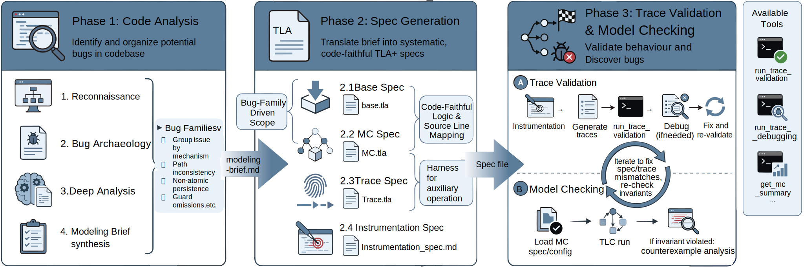

# Specula: A framework for finding deep bugs in system code using TLA+

Specula is an AI-powered framework that uses TLA+ formal specification to find bugs in system code. Specula uses LLMs to accelerate formal modeling, from code analysis to specification generation to trace validation, significantly reducing the cost and effort of formal specification and verification of system code.

We have been applying Specula to find deep bugs in distributed system code. See the [running list of bugs](https://docs.google.com/spreadsheets/d/1AVXdKjNfD4952hZqyB-_wTdrzeTw0SD73f3F0zWJ0as) found by Specula.

[Get started here!](#quick-start)

## Overview



Specula is a multi-phase agentic workflow. Each phase is driven by a dedicated skill that encodes knowledge and methodology and is materialized by a coding agent.

1. **Code Analysis.** The agent statically analyzes the target codebase with the following actions: (1) understanding core modules, (2) mining Git history and GitHub issues, (3) comparing the code against the reference paper and reference systems (if any) to detect deviations, (4) grouping its findings based on “bug families”, and (5) producing a _modeling brief_ that guide specification generation.

2. **Specification.** The agent translates the modeling brief into the following four specifications: (1) a TLA+ model that conforms to the control flow of the target code, (2) a model-checking specification with counter-bounded actions, (3) a trace-validation specification, and (4) a specification for code instrumentation.

3. **Trace Validation and Model Checking.** The agent alternates the following tasks:

- **Trace Validation** — Verifying that the model can reproduce every state transition observed in a real execution trace, catching model-code gaps before model checking.
- **Model Checking** — Exploring the state space to find invariant violations and analyzing counterexamples to determine if they are code bugs, model bugs, or known issues.

## Quick Start

Specula runs as a set of code agent skills and MCP tools. It currently supports [Claude Code](https://docs.anthropic.com/en/docs/claude-code), [Codex](https://openai.com/codex/), and [GitHub Copilot CLI](https://docs.github.com/en/copilot), with more agents to be supported in the future.

### Prerequisites

- Python 3.8+ with pip
- Java 21+ with Maven
- GitHub CLI `gh`
- A supported code agent (Claude Code, Codex, or Copilot CLI) — you can contribute an adapter for your favourite agent [here](./scripts/launch/adapters)!

### Setup

```bash
git clone https://github.com/specula-org/Specula.git && cd Specula
bash scripts/infra/setup.sh
```

<details>
<summary>Alternative: Manual Agent Setup</summary>
You will need to set up the Specula Agent Skills and MCP with your coding agent.

- To set up skills, symlink [the Specula `skills` folder](https://github.com/specula-org/Specula/tree/main/skills) to the appropriate folder read by your coding agent. For Claude, this is `~/.claude/skills` or `.claude/skills`. For Codex, this is `~/.codex/skills` or `.agents/skills`. For Copilot CLI, this is `.github/skills`.
- To set up the MCP, add the `trace_debugger`, `spec_analyzer`, and `inv_checking_tool` MCPs [here](https://github.com/specula-org/Specula/tree/main/tools/) to your agent config. Be sure to build the CFA tool [here](./tools/cfa) with Maven before adding the `spec_analyzer`.

```bash
# for trace debugger MCP
cd tools/trace_debugger
python3 -m venv .venv
. .venv/bin/activate
pip install -r requirements.txt

# for Claude Code
claude mcp add --transport stdio --scope project \
    --env SPECULA_ROOT=$PWD \
    tracedebugger -- \
    $PWD/tools/trace_debugger/.venv/bin/python \
    $PWD/tools/trace_debugger/mcp_server.py

# for Codex
codex mcp add tracedebugger \
	--env SPECULA_ROOT=$PWD -- \
	$PWD/tools/trace_debugger/.venv/bin/python \
	$PWD/tools/trace_debugger/mcp_server.py
```

</details>

This will install the Specula Agent Skills and MCPs.

### Interactive Mode

Open your coding agent in the Specula directory. The workflow is a sequence of skills, each producing input for the next:

`/code-analysis` → `/spec-generation` → `/harness-generation` → `/validation-workflow` → `/bug-confirmation`

Tell the agent your target system (repo path, language, reference algorithm) and invoke `/code-analysis` to start.

### Scripted Mode

For batch or fully automated runs, place your target repository at `case-studies/<name>/artifact/<repo>/`, then run:

**Full pipeline** (all three phases):

```bash
bash scripts/launch/launch_pipeline.sh cometbft

# optionally, you can provide more context of the form "<project name>|<github repo>|<language>|<description>"
bash scripts/launch/launch_pipeline.sh cometbft|cometbft/cometbft|Go|Tendermint BFT
```

Your final spec will be output to `case-studies/cometbft/spec`. See [here](https://github.com/specula-org/Specula/blob/main/scripts/launch/launch_pipeline.sh#L19) for more CLI options (e.g. specifying which agent to use)

**Individual phases:**

```bash
# Phase 1: Code analysis
bash scripts/launch/launch_code_analysis.sh cometbft

# Phase 2: Specification
bash scripts/launch/launch_spec_generation.sh cometbft

# Phase 3: Trace Validation and MC
bash scripts/launch/launch_spec_validation.sh cometbft
```

## Note

Specula has evolved significantly over the past months. Specula-v1 was a four-step code-to-model synthesis tool (which is [archived](../../tree/archive/v1)).

## License and Contributing

See [LICENSE](LICENSE) for details. Also see [CONTRIBUTING](./CONTRIBUTING.md) for contributor sign-off requirements.
