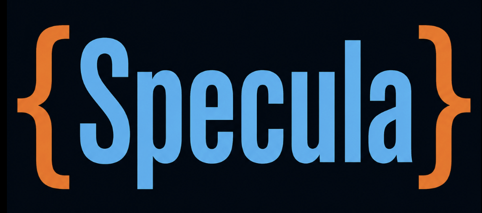

<p align="center">
  <picture>
    <source media="(prefers-color-scheme: dark)" srcset="pics/logo.png">
    
  </picture>
</p>

<h2 align="center">
Scaling formal specs for autonomous bug finding
</h2>

<p align="center">
  <a href="https://arxiv.org/abs/2607.25333">
    
  </a>
  <a href="https://github.com/specula-org/Specula/actions/workflows/ci.yml">
    
  </a>
  <a href="https://github.com/specula-org/Specula/blob/main/LICENSE">
    
  </a>
</p>

Specula finds deep bugs in concurrent and distributed system code. 
It uses coding agents to write TLA+ specs of the target system, including invariants that capture the system's correctness properties and formal models that describe the system implementation. It then model-checks the specs and reproduces violations at the code level. Specula has been used to find deep bugs in many open-source projects. For more details, see our [paper](https://arxiv.org/abs/2607.25333).

We maintain [a list of bugs found by Specula](https://docs.google.com/spreadsheets/d/1AVXdKjNfD4952hZqyB-_wTdrzeTw0SD73f3F0zWJ0as). We would love to hear about the bugs you find using Specula.

Browse the [case-study archive](https://github.com/specula-org/specula-case-studies) for reports, models, and reproduction evidence. The `case-studies` submodule pins the archive and its [system and run indexes](https://github.com/specula-org/specula-case-studies/blob/2797de3e0801442d3451f26491ccfe876aaf2f2f/catalog/README.md) for this checkout.

## Specula Lite

Install just the [Specula Lite skill](skills/specula-lite/SKILL.md) into your coding agent:

```bash
npx skills add specula-org/Specula --skill specula-lite
```

Invoke `specula-lite` in your agent and tell it which code and problems to investigate. One agent handles analysis, TLA+ modeling, model checking, and code-level reproduction, then reports reproduced bugs and unconfirmed findings separately. It asks before proceeding to fixes. Lite supports long investigations without a default task deadline and skips implementation-trace instrumentation and trace validation.

Lite needs a coding agent with skills and shell access, plus Python 3.10+. On first use it automatically prepares missing Java and TLA+ tools in the user cache. No Specula CLI, MCP configuration, or full repository checkout is required. You can also copy the complete `skills/specula-lite` directory into your agent's skills directory. The setup below is for standard Specula.

## Prerequisites

- Python 3.10+ with pip
- [uv](https://docs.astral.sh/uv/)
- Java 21+ with Maven
- GitHub CLI `gh`
- Supported agents (Claude Code, Codex, Copilot CLI, OpenCode, or Pi). Please contribute [adapters](./scripts/launch/adapters) for new agents.
- Coding agent. (Specula uses coding agents to read code, infer invariants, and reason about counterexamples.)
- **Machine:** We recommend at least 32 GB of RAM and 100 GB of free disk space; more RAM is preferable. See the [Usage Guide](./docs/Usage.md).

> **Windows:** run Specula inside [WSL2](https://learn.microsoft.com/windows/wsl/install). Native Windows (outside WSL2) is not supported yet.

## Recommended Coding Agents

We recommend using the following coding agents, which we actively test:
* Claude Code with Claude Opus 4.8 or Fable
* Codex with GPT-5.5 or GPT-5.6-Sol

Other strong coding agents may work, but we do not test them regularly during our development. We recently tested Claude Code with GLM-5.2, Kimi 2.7, and DeepSeek V4 (see [Usage Guide](./docs/Usage.md)).

**For GPT-5.6-Sol and Fable**, apply for Trusted Access through [OpenAI](https://chatgpt.com/cyber) and [Anthropic](https://portal.anthropic.com/programs/cvp), respectively. Without the required access, providers may block bug-reproduction requests during confirmation. If you cannot obtain access, use [hybrid configuration](./docs/Usage.md#hybrid-agent-configuration) to select another agent or model for that phase.

## Setup

```bash
git clone https://github.com/specula-org/Specula.git && cd Specula
uv tool install -e .   # installs the `specula` command
specula setup          # installs the agent skills and MCP tools, builds the bundled tools
```

<details>
<summary>Manual Setup</summary>

You need to set up the Specula Agent Skills and MCP with your coding agent.

- Symlink [the Specula `skills` directory](https://github.com/specula-org/Specula/tree/main/skills) to the one read by your coding agent, e.g., `~/.claude/skills` or `.claude/skills` for Claude Code, `~/.codex/skills` or `.agents/skills` for Codex, and `.github/skills` for Copilot CLI.
- Add the `trace_debugger`, `spec_analyzer`, and `inv_checking_tool` [MCP tools](https://github.com/specula-org/Specula/tree/main/tools/) to your agent config. Please [build the CFA tool](./tools/cfa) with Maven before adding `spec_analyzer`.

```bash
# for trace debugger MCP
cd tools/trace_debugger
python3 -m venv .venv
. .venv/bin/activate
pip install -r requirements.txt
cd ../..  # return to the Specula repository root

# for Claude Code
claude mcp add --transport stdio --scope project \
    tracedebugger \
    --env "SPECULA_ROOT=$PWD" -- \
    "$PWD/tools/trace_debugger/.venv/bin/python" \
    "$PWD/tools/trace_debugger/mcp_server.py"

# for Codex
codex mcp add tracedebugger \
	--env "SPECULA_ROOT=$PWD" -- \
	"$PWD/tools/trace_debugger/.venv/bin/python" \
	"$PWD/tools/trace_debugger/mcp_server.py"

# for GitHub Copilot CLI 1.0.21+
copilot mcp add tracedebugger \
    --env "SPECULA_ROOT=$PWD" -- \
    "$PWD/tools/trace_debugger/.venv/bin/python" \
    "$PWD/tools/trace_debugger/mcp_server.py"
```

Automatic MCP configuration is skipped for older Copilot CLI versions; upgrade to the latest version to enable it.

</details>

## Auto Mode

```bash
specula run mysys \
  --artifact=/path/to/repo \
  --guidance=/absolute/path/to/mysys-guidance.md
```

The `mysys-guidance.md` is optional but recommended.
It is a configuration file that guides Specula to focus on target modules and scenarios,
	with consistent modeling scope across runs.
We provide a [template](./docs/modeling-guidance-template.md) and an
[example](./docs/modeling-guidance-example.md).

Outputs are stored in `runs/<run-id>`. 
After a run, start with `runs/latest/pipeline-summary.md`.

Add `--keep-original` to leave the source checkout untouched. Specula runs the
same agents against a full private copy and writes a reviewable source diff to
`runs/<run-id>/mysys/changes.patch`. Ignored build output is omitted, while
binary and trace contents remain in the private source instead of being
inlined. Specula does not apply the diff to the original checkout.

The detailed usage and configurations can be found in the [Usage Guide](./docs/Usage.md).

## Continuous Verification

Initialize a persistent model and harness, then check later source changes incrementally:

```bash
specula run --ci-init --ci-dir=/work/mysys-ci \
  --artifact=/path/to/repo --guidance=/path/to/mysys-guidance.md mysys
specula run --incremental --ci-dir=/work/mysys-ci
```

Keep the CI directory outside the source checkout. See [Add Specula to CI](docs/Usage.md#add-specula-to-ci) for setup, results, and the GitHub Actions workflow. Existing TLA+ models and verification assets can be imported with [Bring Your Own Model](docs/Usage.md#bring-your-own-model-byom).

## Interactive Mode

Open your coding agent in the Specula directory. The workflow is a sequence of skills, each producing input for the next:

`code-analysis` → `spec-generation` → `harness-generation` → `validation-workflow` → `bug-confirmation`

(Codex uses `$code-analysis`, `$spec-generation`, etc. after choosing `y` in `specula setup`, or `$specula-codex:code-analysis`, `$specula-codex:spec-generation`, etc. in plugin mode.)

To start, tell the agent your target and invoke the first skill:

```
This project is a Go implementation of Tendermint BFT consensus (cometbft/cometbft).
The reference algorithm is the Tendermint paper (arXiv:1807.04938). Run /code-analysis.
```

Each skill produces output files (e.g., `modeling-brief.md`, `base.tla`, traces) in `.specula-output` that the next skill will consume. 
When one skill completes, invoke the next. You can also run any skill independently, e.g., `validation-workflow` on an existing spec.

## Changelog

See [CHANGELOG.md](CHANGELOG.md) for release history and notable changes.

## Acknowledgement

We are grateful to the generous support from
* TLA+ Foundation
* OpenAI
* Anthropic (AI for Science Program)
* Qingrong Chen

## License

[Apache License 2.0](LICENSE).
