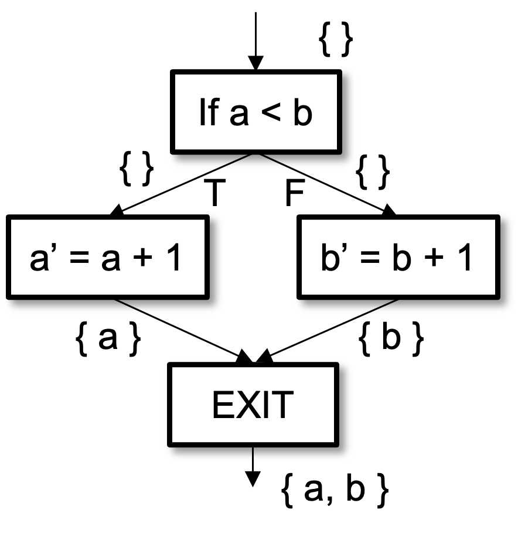
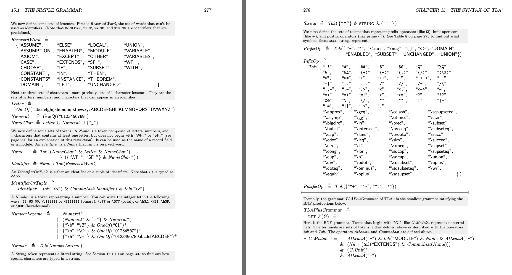
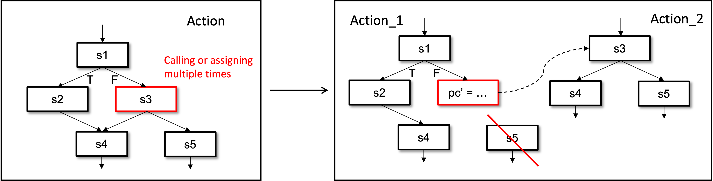
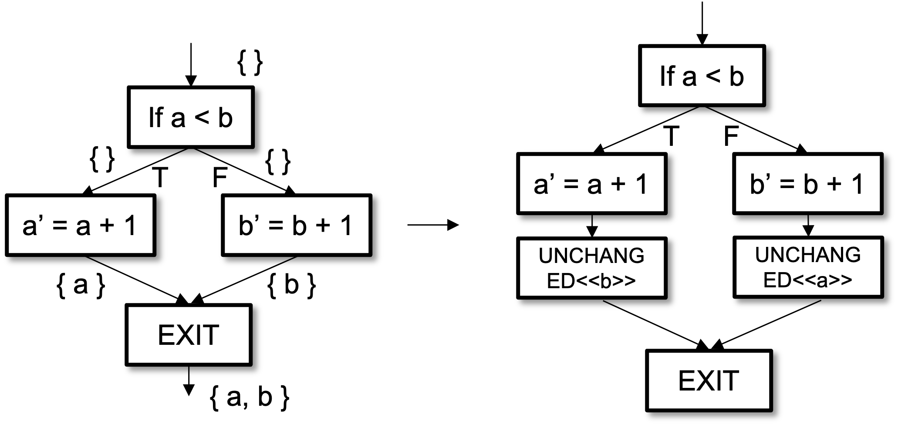
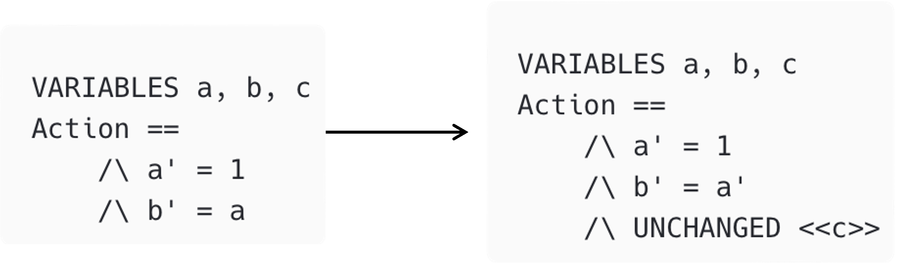

# TLA+ CFA

This is Specula's **Control Flow Analysis (CFA) subcomponent**.
Although it is currently a submodule of the Specula project, its usage does not depend on other Specula modules and can be used independently (e.g., for automatically adding `UNCHANGED` statements). This document focuses on introducing the features used by Specula.

In the Specula project, the framework performs control flow analysis on TLA+ specifications 
    to transform *translated specs* (raw specs that were directly translated from source code) 
    into specs that can be accepted by TLC. 

The algorithms mainly solve three problems:

1. Single Assignment Constraint: In atomic actions, a variable can be assigned at most once.
2. UNCHANGED Requirement: For variables that are not modified in atomic actions, explicit `UNCHANGED <<var>>` statements must be provided.
3. State Annotation: Variables that use modified states in atomic actions need to be explicitly annotated (using `'`).

<details><summary><h2 style="display:inline-block">Definitions</h2></summary>

### Translated Spec

A **translated Spec** is obtained by using LLMs to translate source code into the TLA+ format on a statement-by-statement basis. 
A translated spec strictly describes the logic of the code and the control flow of the statements. 
However, due to multiple assignments and complex calling relationships in source code, 
    the translated spec is often not accepted by TLC.

One may be curious why not not directly use LLMs to generate a TLA+ specification instead of doing translation first? 
In our experience, LLMs suffer from overfitting and over-imitation of well-known specifications;
so, directly generating the TLA spec often misses or oversimplifies logic, 
    making it impossible to precisely describe the source code.

For example, in the following translated spec, the `electionElapsed` variable is modified twice, 
    violating the definition of atomic actions in TLA+:

```tla
tickHeartbeat(s) ==
    /\ electionElapsed' = [electionElapsed EXCEPT ![s] = electionElapsed[s] + 1]
    /\ IF electionElapsed'[s] >= 3
       THEN /\ electionElapsed' = [electionElapsed' EXCEPT ![s] = 0]
            /\ ...
       ELSE /\ UNCHANGED <<messages, leadTransferee>>
    /\ ...
```

### Control Flow in TLA+

Our CFA framework treats each statement as an atomic code block unit, recording the calling and transfer relationships between code blocks, and analyzing all variables that may be assigned when reaching each code block.

For the following TLA+ code:

```tla
IF a < b 
    THEN a' = a + 1
    ELSE b' = b + 1 
```

The following control flow is obtained:



</details>

## Control Flow Graph Construction

The control flow analysis framework mainly consists of a 3-step pipeline:
**Translated spec in TLA+ → CFG (Control Flow Graph) → CFA (Control Flow Analysis) → TLA+ spe*c.*

### Compilation

We started with lexical analysis and syntax analysis 
    on the translated spec (or in fact any input spec) to obtain an Abstract Syntax Tree (AST).

After obtaining the AST, we establish code blocks with statements as units, 
    building transfer relationships and calling relationships between code blocks 
    by traversing the code blocks. 

We build on the TLA+ SANY AST. See [SANYCFGBuilder.java](../tools/cfa/src/main/java/CFG/SANYCFGBuilder.java)

<details><summary><h3 style="display:inline-block">Lexical and Syntactic Rules</h3></summary>

The rules are mainly referenced from Lamport's **"Specifying Systems"**.



We address the following challenges:
- We modified the original rules to resolve ambiguities. See [TLAPlusLexer.g4](../tools/cfa/src/main/java/grammar/TLAPlusLexer.g4) and [TLAPlusParser.g4](../tools/cfa/src/main/java/grammar/TLAPlusParser.g4)
- We work towards better indentation sensitivity. We borrowed techniques from Python Documentation's ANTLR4-based Python syntax analyzer. By rewriting the CommonTokenStream after lexical analysis to match indentation-sensitive rules. See [TLAPlusLexerBase.java](../tools/cfa/src/main/java/parser/TLAPlusLexerBase.java)

</details>

## Control Flow Analysis (CFA)

Our CFA transforms the CFG through three main algorithms to make it conform to TLA+'s atomic action semantics. 
The implementation is located in [CFG](../tools/cfa/src/main/java/CFG).

### Static Analysis Preprocessing

First, CFA performs static analysis on the input spec 
    to identify potential problems that violate TLA+ atomicity requirements.

We perform the following steps:
- Analyze variable modification situations and dependency relationships
- Mark non-atomic operation segments that require subsequent transformation  
- Provide necessary data flow and function call information for subsequent algorithms

These subsequent algorithms are invoked separately.

<details><summary><h3 style="display:inline-block">Process Cutting Algorithm</h3></summary>

This is the core transformation algorithm that resolves contradictions 
    between imperative control flow and TLA+'s atomic state transition requirements.
    
This is necessary because a single function in high-level programming languages may contain multiple assignments to the same variable or multiple logical steps, while in TLA+ each step must be modeled as an independent atomic action.

Our solution systematically decomposes complex actions in the input spec by:
- Introducing auxiliary state variables (e.g., program counter `pc`, call stack `stack`, etc.) to manage execution context
- Automatically splitting single large actions into multiple TLA+-compatible atomic action sequences

The algorithm can automatically distinguish between simple function calls directly inlined into the caller's action sequence, and complex function calls transformed into independent atomic action sequences, with execution flow managed through auxiliary variables

**Example**:



[`pc_example.tla`](../tools/cfa/input/example/pc_example.tla) demonstrates complex function call chains that violate single assignment constraints. The algorithm transforms nested function calls into independent atomic actions.

```bash
./specula step2 ./tools/cfa/input/example/pc_example.tla ./tools/cfa/output/pc_result.tla --algorithm pc
```

</details>

<details><summary><h3 style="display:inline-block">UNCHANGED Convergence Algorithm</h3></summary>

Solves the problem that TLA+ requires all variables in each atomic action to be explicitly handled see (see [tlaplus-677](https://github.com/tlaplus/tlaplus/issues/677)). It automatically inserts `UNCHANGED` clauses for variables not modified in actions.

It does so by analyzing control flow confluence points (where multiple execution paths merge) and the variable states at these key points. Then, it adds `UNCHANGED` clauses only when necessary to avoid over-constraining the model.

**Example**:



[`uc_example.tla`](../tools/cfa/input/example/uc_example.tla) showcases complex branching control flow where different paths modify different variables. The algorithm automatically adds appropriate `UNCHANGED` statements.

```bash
./specula step2 ./tools/cfa/input/example/uc_example.tla ./tools/cfa/output/uc_result.tla --algorithm uc
```

</details>

<details><summary><h3 style="display:inline-block">Variable State Update Algorithm</h3></summary>

Handles the syntax requirements for current state and next state variables in TLA+. This is because the translated Spec reflects an imperative memory state model, while TLA+ needs to clearly distinguish between a variable's current state value and next state value.

We thus refactor expressions to conform to TLA+'s state transition syntax conventions, ensuring all next-state assignments are correctly annotated (using the `'` symbol).

**Example**:



[`ud_example.tla`](../tools/cfa/input/example/ud_example.tla) illustrates chained variable dependencies where modified variables are used in subsequent expressions. The algorithm correctly handles current vs. next state annotations.

```bash
./specula step2 ./tools/cfa/input/example/ud_example.tla ./tools/cfa/output/ud_result.tla --algorithm ud
```

</details>

## TLA+ Specification Generation

The final stage serializes the transformed and validated CFG into a structurally correct TLA+ specification:

We uses a dedicated **TLA+ CFG Printer** with a recursive strategy to convert CFG into TLA+ textual representation. Its implementation is located in [printer](../tools/cfa/src/main/java/printer). This printer identifies control flow confluence points, recursively generates the corresponding TLA+ action expressions, and combines them to generate complete specifications.

The final output specification should be:
- Structurally correct and formally complete
- Conformant to TLA+ atomic action semantics
- Faithfully model of the logic of the original imperative code
- Able to be directly verified by the TLC model checker
