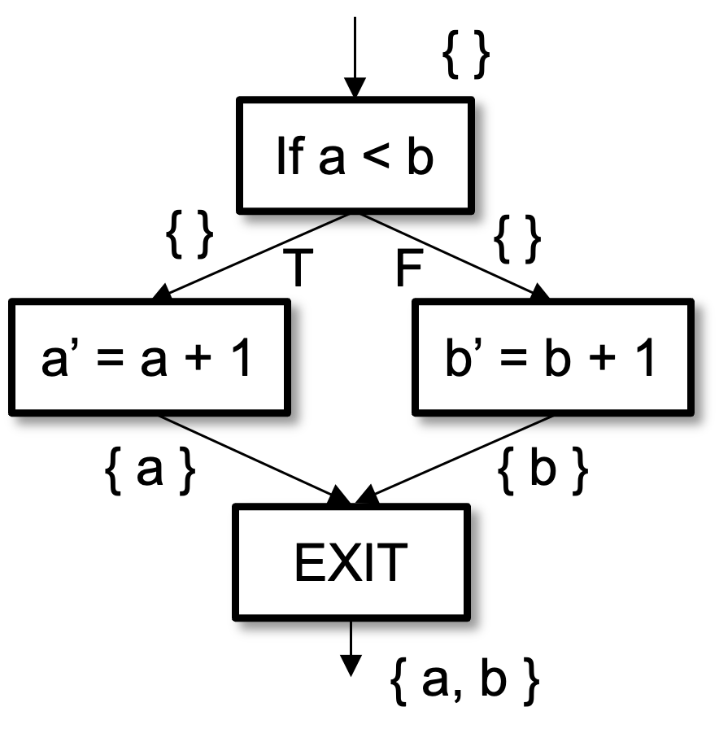
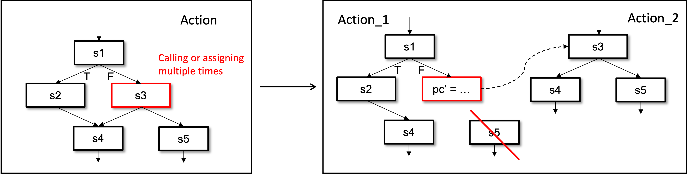
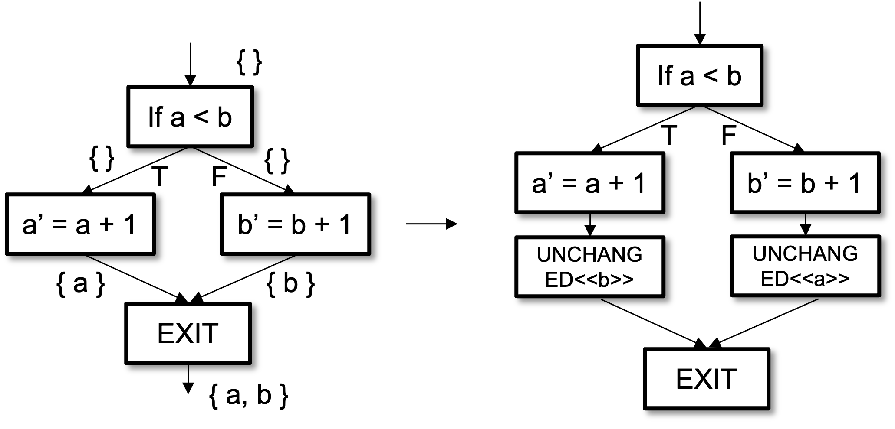
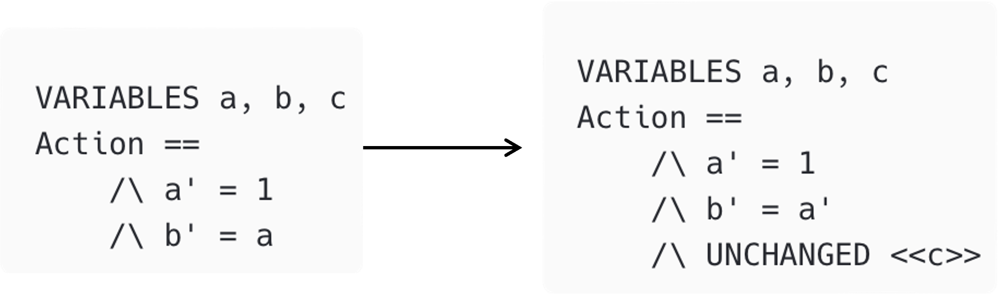

# CFA: Control Flow Analysis for TLA+

CFA is a static analysis and transformation tool for TLA+ specifications, built on the SANY AST and a custom ANTLR4 grammar. It builds a control-flow graph (CFG) of each action — each statement is a code-block node, with edges for transfer and calling relationships — and checks or transforms the spec against TLA+'s atomic-action semantics:

1. **Single assignment** — within one action, a variable is assigned at most once.
2. **UNCHANGED requirement** — variables an action does not modify need an explicit `UNCHANGED`.
3. **State annotation** — expressions reading already-modified state must use the primed (`'`) value.



## Role in the Specula pipeline

The pipeline uses CFA as the backend of the `spec_analyzer` MCP: its `run_vav_analysis` tool runs the `vav` algorithm (Variable Assignment Validation) to check that every action assigns or `UNCHANGED`s every declared variable in every branch. This catches missing and duplicate assignments that SANY and TLC do not report (see [tlaplus#677](https://github.com/tlaplus/tlaplus/issues/677)). Agents run it on generated specs before model checking (see `skills/tla-checking-workflow`).

## Build and run

`scripts/infra/setup.sh` builds CFA as part of setup. Manual build needs Java 21+, Maven, and `lib/tla2tools.jar`:

```bash
cd tools/cfa && mvn package -DskipTests
```

```bash
./run.sh <input.tla> <output.tla> [--algorithm all|sa|uc|ud|pc|vav] [--debug] [--show-tree]
```

| Algorithm | Purpose |
|-----------|---------|
| `vav` | Check only: report missing/duplicate variable assignments per action branch (the pipeline's entry point) |
| `sa` | Static analysis of variable modifications and dependencies (feeds the algorithms below) |
| `uc` | Insert `UNCHANGED` clauses at control-flow confluence points, only where necessary |
| `ud` | Rewrite reads of already-modified variables to their primed (`'`) form |
| `pc` | Process cutting: split actions with multiple assignments to one variable into sequences of atomic actions, managed by auxiliary `pc`/`stack` variables |
| `all` | Full transformation pipeline (default) |

## Standalone spec transformation

Beyond the `vav` check, CFA can rewrite a spec that violates atomic-action semantics into a TLC-accepted one (spec → CFG → transform → print). This powered Specula v1, which translated source code into TLA+ statement-by-statement and then repaired the result; it works on any input spec and does not depend on the rest of Specula.

A typical input problem — `electionElapsed` is assigned twice in one action:

```tla
tickHeartbeat(s) ==
    /\ electionElapsed' = [electionElapsed EXCEPT ![s] = electionElapsed[s] + 1]
    /\ IF electionElapsed'[s] >= 3
       THEN /\ electionElapsed' = [electionElapsed' EXCEPT ![s] = 0]
            /\ ...
       ELSE /\ UNCHANGED <<messages, leadTransferee>>
    /\ ...
```

Each transformation has a runnable example under [`input/example/`](./input/example):

- **Process cutting** (`pc`) — decomposes nested function calls and multi-assignment actions into independent atomic actions:

  

  ```bash
  ./run.sh input/example/pc_example.tla output/pc_result.tla --algorithm pc
  ```

- **UNCHANGED convergence** (`uc`) — branches modify different variables; the algorithm adds the missing `UNCHANGED` clauses:

  

  ```bash
  ./run.sh input/example/uc_example.tla output/uc_result.tla --algorithm uc
  ```

- **Variable state update** (`ud`) — chained dependencies on modified variables get correct current- vs next-state annotations:

  

  ```bash
  ./run.sh input/example/ud_example.tla output/ud_result.tla --algorithm ud
  ```

## Implementation

- Grammar: [`src/main/java/grammar/`](./src/main/java/grammar) (ANTLR4, disambiguated from the *Specifying Systems* grammar), with an indentation-sensitive lexer base in [`src/main/java/parser/TLAPlusLexerBase.java`](./src/main/java/parser/TLAPlusLexerBase.java)
- CFG construction on the SANY AST: [`src/main/java/CFG/SANYCFGBuilder.java`](./src/main/java/CFG/SANYCFGBuilder.java); transformation algorithms and the `vav` checker ([`VAVAnalyzer.java`](./src/main/java/CFG/VAVAnalyzer.java)) live in [`src/main/java/CFG/`](./src/main/java/CFG)
- TLA+ output printer: [`src/main/java/printer/`](./src/main/java/printer)
- CLI entry point: `CFG.SANYTransformerCli`, wrapped by [`run.sh`](./run.sh)
